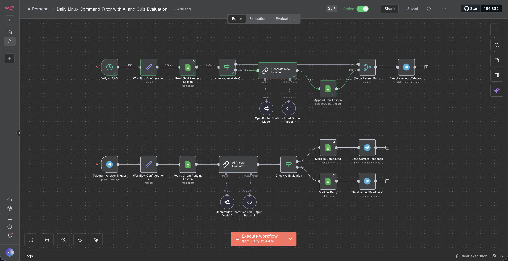
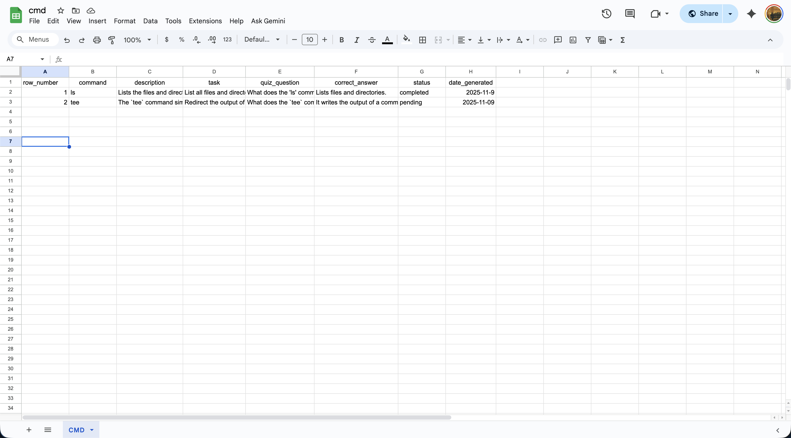
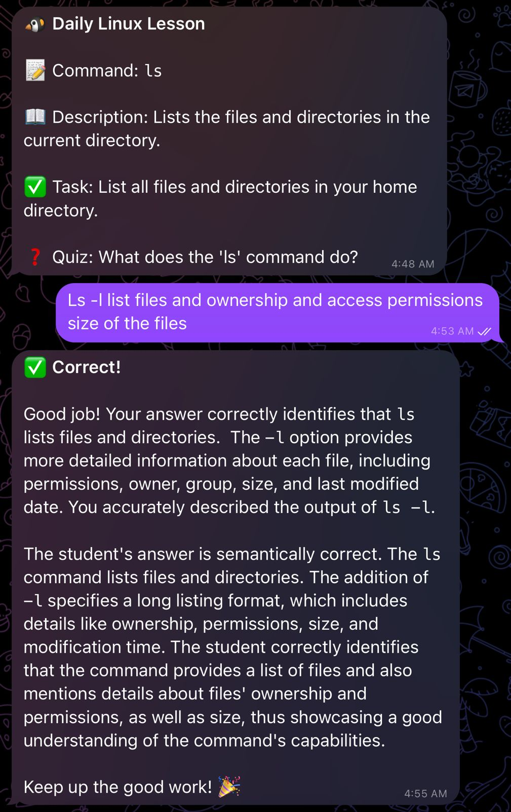

# Daily Linux Command Tutor — n8n Workflow

**Try the bot:** [https://t.me/Cmd_mac_bot](https://t.me/Cmd_mac_bot)

  
  
  

This repository contains an n8n automation that delivers one beginner-friendly Linux/macOS terminal command per day, quizzes the user, evaluates the answer using an AI evaluator, and tracks progress in Google Sheets.

The workflow file included: `Daily Linux Command Tutor with AI and Quiz Evaluation.json` (importable into n8n).

## What this README covers
- High-level flow
- Important nodes and how they interact
- Google Sheet structure required
- Placeholders and credentials to configure
- How to import, test and run the workflow

---

## High-level flow

1. Daily at 9 AM a `scheduleTrigger` fires.
2. The workflow checks Google Sheets for the next `pending` lesson.
3. If a lesson exists, it uses that; otherwise it asks an LLM to generate a new lesson (structured JSON), parses and appends it to the sheet.
4. The chosen lesson is sent to the configured Telegram chat.
5. A Telegram webhook listens for the user's reply. When received, the workflow fetches the current pending lesson, sends the user's answer and the lesson data to an AI evaluator (semantic/comparison), and receives a structured evaluation (is_correct, explanation, feedback).
6. Based on the evaluator result, the sheet row is updated to `completed` or `retry`, and the user receives appropriate feedback via Telegram.

---

## Key nodes (from the provided JSON)

- `Daily at 9 AM` — `scheduleTrigger` (node id: dd937022-...)
- `Workflow Configuration` — `set` node to hold placeholders (sheet id, sheet name, telegramChatId)
- `Read Next Pending Lesson` — Google Sheets v4 read (filters for status = "pending")
- `Is Lesson Available?` — `IF` node deciding existing vs generate
- `Generate New Lesson` — LangChain LLM node (structured output)
- `Structured Output Parser` — converts AI output to fields: command, description, task, quiz_question, correct_answer
- `Append New Lesson` — Google Sheets node (appendOrUpdate) stores new lessons with status `pending` and date_generated
- `Merge Lesson Paths` — `merge` node to pick either the existing lesson or the newly generated one
- `Send Lesson to Telegram` — sends the lesson message to the configured chat

Answer evaluation flow:

- `Telegram Answer Trigger` — Telegram webhook waits for user message
- `Workflow Configuration 2` — `set` node to capture `userAnswer` and other placeholders
- `Read Current Pending Lesson` — Google Sheets read the current pending lesson
- `AI Answer Evaluator` — LangChain LLM evaluates the student answer semantically
- `Structured Output Parser 2` — parses evaluator output (fields: is_correct, explanation, feedback)
- `Check AI Evaluation` — IF node checks `is_correct` boolean
- `Mark as Completed` / `Mark as Retry` — Google Sheets update nodes to set the status
- `Send Correct Feedback` / `Send Wrong Feedback` — Telegram nodes to notify the user

NOTE: The JSON uses both an OpenRouter language model and LangChain LLM wrapper nodes; credentials in your n8n instance must match the node types used.

---

## Expected Google Sheet structure

Create a Google Sheet (sheet name used in the workflow: the JSON references `gid=0` and columns below). Add these headers in row 1:

| Column | Description |
|---|---|
| row_number | (optional) numeric row number (used by the Google Sheets node)
| id | optional unique id for the lesson (can be auto-generated)
| command | command name (e.g., `tldr`) |
| description | short explanation |
| task | a small hands-on task for the user |
| quiz_question | the quiz question to evaluate |
| correct_answer | canonical correct answer (used by append step and for reference) |
| status | `pending` / `completed` / `retry` |
| date_generated | date the lesson was created (YYYY-MM-DD)

The workflow expects a `status` column and filters rows where `status == "pending"`.

---

## Placeholders & credentials to update after import

Open the imported workflow in n8n and replace the following placeholders / credentials:

- Google Sheets OAuth credential on Google Sheets nodes (`Read Next Pending Lesson`, `Append New Lesson`, `Read Current Pending Lesson`, `Mark as Completed`, `Mark as Retry`).
- The Google Sheet ID referenced in `Workflow Configuration` or directly in the Google Sheets nodes — replace with your sheet ID.
- Telegram credential (bot token) and chat ID (used in `Send Lesson to Telegram` and feedback nodes). The JSON contains a `chatId` value like `6531798741` — replace with your chat ID or set in the `set` node placeholders.
- OpenRouter / LangChain credentials used by `Generate New Lesson`, `AI Answer Evaluator`, and the `lmChatOpenRouter` nodes. Ensure the node-specific credential type matches your n8n credential (OpenRouter or OpenAI via LangChain connector).

---

## How to import and test

1. Open your n8n instance.
2. Import the workflow file: `Daily Linux Command Tutor with AI and Quiz Evaluation.json`.
3. Configure credentials as listed above.
4. Optionally, add a couple of sample rows in your Google Sheet with `status = pending` to test the existing-lesson path.
5. Test delivery: open the workflow and click "Execute Workflow" on the daily-flow portion (or run the schedule trigger manually). Confirm you receive a Telegram message with a lesson.
6. Test evaluation: reply in Telegram with an answer. Verify the second workflow triggers (Telegram webhook), evaluates the answer, updates the sheet, and sends feedback.

Quick test tips:

- To simulate the AI generation path, make sure there are no `pending` rows in the sheet and then run the daily flow — the workflow should call the LLM, parse the structured output, append a new row, then send it to Telegram.
- To test the evaluator, use a pending lesson and reply with a known correct or incorrect answer to see both feedback branches.

---

## Notes & gotchas

- The LLM nodes in this JSON are wrapped via LangChain nodes and OpenRouter models. If you prefer direct OpenAI calls or another model, swap the model nodes but keep the structured output parser contract (JSON with fields: `is_correct`, `explanation`, `feedback` for evaluator; and `command`, `description`, `task`, `quiz_question`, `correct_answer` for lesson generation).
- The Append/Update node uses `appendOrUpdate` and `matchingColumns` set to `command`. If you prefer strictly appending, switch to `append` mode.
- Ensure Telegram webhooks are reachable by your n8n instance (if self-hosted you may need to use a tunnel or expose webhooks correctly).

---

## Where to go next

- Customize the AI prompt in `Generate New Lesson` to change style, difficulty, or topics.
- Add a weekly summary job to summarize progress or show streaks.
- Replace Google Sheets with n8n Data Stores or a database if you prefer more scalable storage.

If you'd like, I can also:

- adapt the workflow to use direct OpenAI nodes (gpt-4o-mini) instead of OpenRouter/LangChain,
- create a CSV import to seed lessons, or
- add a `/retry` Telegram command node that re-queues a lesson.

---

## Attribution

Generated from `Daily Linux Command Tutor with AI and Quiz Evaluation.json` (imported workflow). Edit the README for custom prompts and further instructions specific to your environment.

---

© 2025 — Automation generated README
