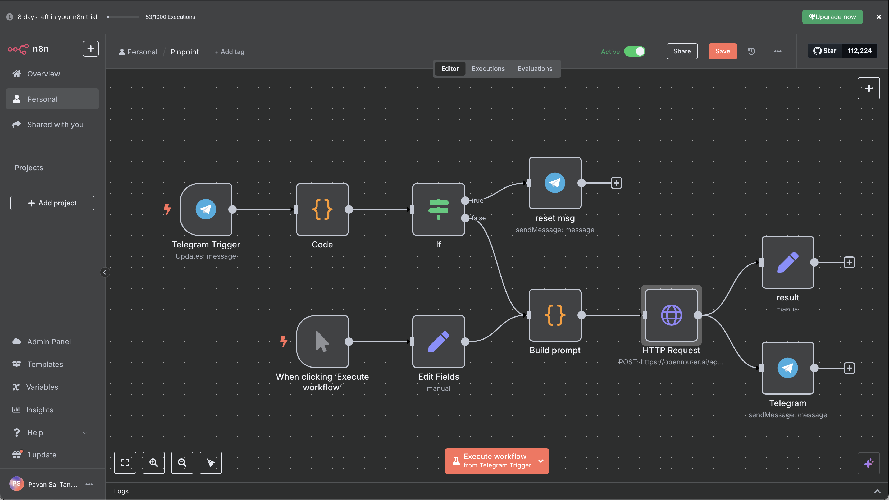
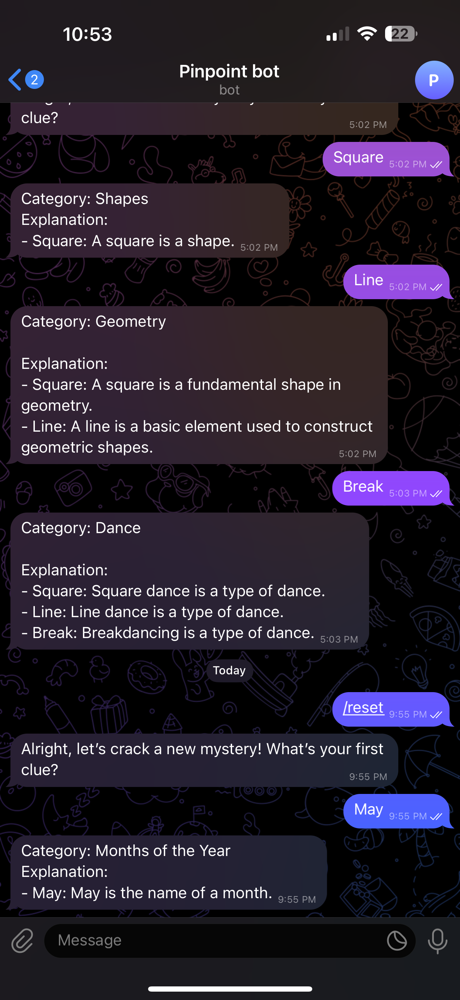
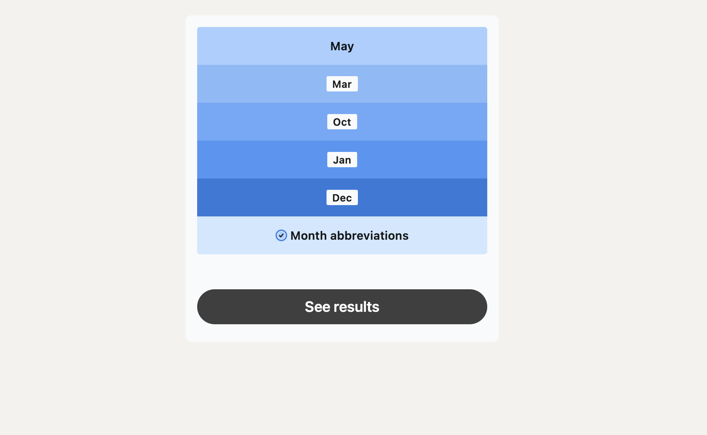

# Pinpoint

**Try the bot:** [https://t.me/Paralexa_bot](https://t.me/Paralexa_bot)

<!-- Images in 3-column layout -->

  
  
  

Pinpoint is an interactive Telegram bot workflow built with n8n that helps users solve word association puzzles. Users submit clues via Telegram, and the bot uses AI to guess the common category and explain the connections.

## Features

- Accepts clues from users through Telegram commands.
- Supports clue reset and new puzzle sessions.
- Uses OpenRouter AI (Google Gemini) to analyze clues and provide category guesses with explanations.
- Sends results and feedback directly in Telegram chat.

## Usage

1. Start the bot and send `/pinpoint` to begin a new puzzle.
2. Submit up to 5 clues, one per message.
3. The bot will analyze the clues and reply with its guess and explanations.
4. Send `/reset` to start a new puzzle at any time.

## Setup

1. Clone the repository and import the workflow into your n8n instance.
2. Configure your Telegram and OpenRouter API credentials in n8n.
3. Deploy and activate the workflow.

## Workflow Overview

- **Telegram Trigger**: Listens for incoming messages.
- **Code Node**: Manages clue collection and session state.
- **If Node**: Handles reset and clue validation.
- **Build Prompt**: Prepares the AI prompt.
- **HTTP Request**: Sends clues to OpenRouter AI for analysis.
- **Telegram Node**: Sends responses back to the user.